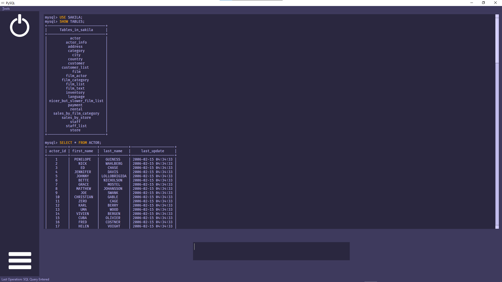

# PySQL
A GUI-based interface for MySQL using the mysql.connector library for Python

PySQL was developed as an HS project that demanded the usage of Python + the mysql.connector library. It aims provide an interface for MySQL that is sleeker than the traditional CLI, and adds further features to improve and refine the usage and the interfacing with MySQL.

As the old adage goes, 'Don't fix what isn't broken', and as such, PySQL strives to refine the article in question as opposed to reinventing the wheel

The full list of features are listed further below

# Requirements

PySQL requires nothing other than the Python STL, the mysql.connector library and PyQT5 to run. It is highly recommended the user installs the [Fira Code Medium](https://github.com/tonsky/FiraCode) and the [Open Sans](https://fonts.google.com/specimen/Open+Sans) font, as several widgets in the program have been built around said fonts

## Features

PySQL brings forth several sweeping changes that attempt to improve the QOL side of things, so to speak. Features include:
	
 - **GUI-based Design**: PySQL is written to take full advantage of modern day GUIs and takes into consideration modern-day UI design cues. It aims to be far sleeker and easier on the eyes than the traditional CLI for MySQL
 - **Syntax Highlighting**: (Keywords of queries and error messages are highlighted
 - **Polling**: Users can 'poll' entered queries to an array and execute every query stored in the array one after the other with the click of a single button
 - **Macros**: Commonly used queries can be assigned to a simple shortcut. PySQL offers 3 macro slots that can be edited and used
 - **Font Family & Size Editing**: Also offered is the ability to change the on-screen font and font sizes (the latter of which can be set individually for the output and input fields of the program window)
 - **Theme Support**: PySQL offers 5 different themes which can be set from the menu
 - **Shortcuts**: Shortcuts allow for operations to be executed at the click of a button (or two). Polling, the entering of macros, launching the settings and quitting the application for instance, can be performed without lifting a finger this way
 - **Auto-Parenthesis Completion**: A left parenthesis being entered as part of a query will be automatically closed with a right parenthesis. The cursor is also then nestled within the parenthesis pair to allow for easy editing
 - **Operation Tracker**: The last performed operation is tracked with the help of the application window's status bar
 - **Command History**: Past queries can be flipped through with ease, using the Up/Down arrow keys, similar to MySQL's CLI

## Gallery 

A picture of the application, showing off the Ube theme

## FAQ

Q1. I just booted up the program and logged in. What do I do?

A. In the text input field to the bottom of the screen, type away as you would in the CLI of MySQL. The results of your operation are displayed in a window above. 
Feel free to get used to the rest of the program, and explore the various items within the menu to get a hold of the various features PySQL has to offer!

Q2. Is there a list of shortcuts used within the program?

A. Launching the help dialog box located within Tools in the menu bar will provide a handy list of shortcuts. Nevertheless, here is a complete list of shortcuts

 - **F(1-3)**: The text within the input field is set to Macro(1-3)
 - **F5**: Wipes the current query and appends it to the poll array
 - **Shift + F5**: Executes all the polled queries on a first-come, first-served 		      basis. The first query to be polled gets executed first
 - **Ctrl + F5**: Wipes the contents of the poll array, allowing for more queries to be appended later
 - **Up/Down**(When input field is focused): Sets input field's text to a query from a list of previously entered queries. Browse through said queries with arrow keys
 - **Ctrl + S**: Launch Settings
 - **Ctrl + Q**: Quit
 - **Alt + T**: Open Menu Bar

 Q3. Will PySQL see active development in the future?
 
 A. It is highly probable that I will never work on this project further, in the near future. It was mainly developed as a HS project, and owing to a super tight schedule in the coming months, I don't see myself working on this any further
 Not to mention, the program doesn't fulfill my 'vision', so to speak, of PySQL being capable of used OVER the CLI of MySQL, owing to a few reasons, one of them including the lack of output text one normally receives with queries that don't generate a table of data, say a query that switches a database

The crux of the problem is that this curious occurrence is most likely due to how the mysql.connector library is implemented in of itself. As such, I don't exactly see how it can be 'fixed'. I expect the project to be put on ice, save for any serious bugs that may rise up and require my attention

